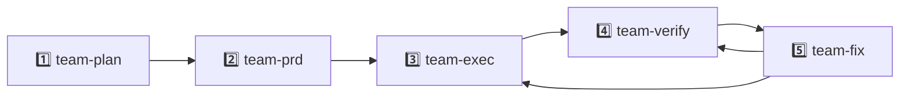

# Oh My Claudecode 文档

将 Claude Code 转变为智能的多智能体（multi-agent）编排系统。你成为指挥家，而非演奏者。

### 19 个专用智能体（Agents）

跨 3 个功能轨道的统一目录，包含 19 个智能体，使用优化的模型（Opus/Sonnet/Haiku）。

### 10 种执行模式

从用于完全自主的 Autopilot（自动驾驶）模式，到用于原生协调的 Team（团队）模式，以及用于持久执行的 Ralph 模式。

集成的工具链，包括语言服务器（Language Servers）、AST grep、Python REPL 和外部 AI 模型。

### 原生团队（Native Teams）

利用 Claude Code 的原生团队能力，通过分阶段执行管道实现。

## 发布说明（Release Notes）

快速摘要

这些更新提升了运行时安全性、团队工作流和发布可靠性。打开每个版本查看详情。

查看 v4.8.0 的变更

  * **Tracer 智能体 & Trace 技能：** 基于证据的因果追踪，包含假设排名、支持/反对证据追踪和不确定性量化。（/trace 命令）
  * **安全加固：** 修复了 21 个安全漏洞，包括 SSRF 绕过、命令注入、原型污染和 shell 注入向量。
  * **HUD Token 使用追踪：** HUD 中实时显示 token 使用情况，可选的转录 token 总计，提供更好的成本可见性。
  * **OMX 团队治理回搬（Backport）：** 加固的团队运行时，包含领导者提醒指导和改进的窗格停滞启发式算法。
  * **统一 MCP 注册表：** 同步的 MCP 注册表现在同步到 Codex 配置，实现一致的服务器管理。

查看 v4.7.0 的变更

  * **原生团队/任务 API：** 添加了 `TeamCreate`、`TaskCreate`、`TaskList`、`TaskGet`、`TaskUpdate` 和 `SendMessage`，用于细粒度的智能体编排。
  * **omc ask 命令：** 新的 `omc ask <claude|codex|gemini>` 流程，用于显式的三模型路由。
  * **技能扩展：** 添加了 14 个新技能，包括 `configure-openclaw`、`deepinit`、`project-session-manager`、`tdd` 和 `trace`。
  * **智能体目录更新：** 在 Build 轨道中引入了 `code-simplifier` 智能体。
  * **弃用：** 遗留的 `omc_run_team_*` 运行时工具现已弃用，推荐使用 Team API。

查看 v4.6.0 的变更

  * **多模型恢复：** 恢复了 `ask-codex` 和 `ask-gemini` 作为非 tmux 环境的高级技能。
  * **上下文优化：** 改进了 `external-context` 钩子，用于更快的大型仓库分析。
  * **UX 优化：** 增强了 `hud` 状态行，包含实时智能体心跳指示器。

查看 v4.5.1 的变更

  * **CLI 命令网关类型：** OpenClaw 可以使用 shell 命令唤醒基于 CLI 的智能体，而非 HTTP 调用。
  * **tmux 尾部捕获：** 捕获最后 15 行终端输出，用于停止和会话结束通知。
  * **Bug 修复：** 修复了 OpenClaw 在 CLI 智能体上的 `HTTP 405` 错误。

查看 v4.5.0 的变更

  * **完整通知系统：** 当 Claude 完成工作或需要输入时，你可以在 Discord、Telegram、Slack 或任何 webhook 上收到警报。
  * **钩子配置和模板引擎：** 你可以使用 `{{variable}}` 模板自定义通知文本。
  * **平台门控：** 仅当你传递正确的 CLI 标志（如 `--telegram` 或 `--discord`）时，通知才会触发。
  * **OpenClaw webhook 网关：** 将你的工作流连接到外部自动化工具。
  * **可靠性修复：** 团队协调、项目内存、LSP 工具和钩子生命周期行为的稳定性得到改善。
  * **清理：** 从遗留兼容层中移除了死代码。

查看 v4.4.0 的变更

  * **破坏性变更：** Codex 和 Gemini MCP 提供程序在 v4.4.0 中被移除（在 v4.6.0 中恢复为高级 `ask-codex` 和 `ask-gemini` 技能）。对于 tmux 工作器，使用 `/omc-teams N:codex` 或 `/omc-teams N:gemini`。
  * **tmux CLI 工作器：** 你可以在可见的 tmux 分割窗格中生成 Claude、Codex 或 Gemini CLI 工作器。
  * **按需生命周期：** 工作器在任务到达时启动，任务完成后停止。
  * **/ccg 三模型技能：** 工作并行分发到 Codex 和 Gemini，然后 Claude 组合结果。
  * **安全加固：** 作业 ID 验证阻止路径遍历，会话清理永远不会杀死你的 shell。

查看 v4.3.x 的变更

  * **团队架构改革：** 团队现在遵循分阶段管道：`plan → prd → exec → verify → fix`。
  * **统一目录：** 19 个统一智能体取代了旧的分层系统，移除了 `-low` 和 `-medium` 后缀。
  * **技能整合：** `ralplan` 合并到 `/plan --consensus`，`review` 合并到 `/plan --review`。
  * **MCP 提供程序升级：** Codex 现在使用 `gpt-5.3-codex`，Gemini 使用 `gemini-3-pro-preview`。

查看 v4.1.0 的变更

  * **原生团队：** Claude Code 支持团队执行，采用分阶段管道。
  * **Team + Ralph 组合：** 你可以将 Team 模式与 Ralph 结合，实现持久执行。
  * **模式变更：** Swarm 已弃用，推荐使用 Team 模式。

## 安装
```
# 1. 添加插件
/plugin marketplace add https://github.com/Yeachan-Heo/oh-my-claudecode
# 2. 安装它
/plugin install oh-my-claudecode
# 3. 运行设置向导
/oh-my-claudecode:omc-setup
```


## 快速入门

OMC 使用"魔法关键词"来检测你的意图。只需描述你想做什么。

  * #### 对需求不确定？

`"/deep-interview '我想构建一个任务管理器'"` — 苏格拉底式提问，在执行前澄清模糊的想法。

  * #### 自主构建

`"autopilot build a React dashboard"` — 从想法到代码的完全自主执行。

  * #### 重构

`"ralph refactor the API"` — 持续工作直到验证干净（"巨石永不停止"）。

  * #### 并行工作

`"ulw fix all typescript errors"` — 并行运行多个智能体以提高速度。

  * #### 原生团队

`"team 5:executor refactor backend"` — 生成由领导者协调的 5 个智能体团队。

  * #### 规划

`"plan the auth system"` — 启动交互式规划访谈。

## 指挥家哲学（Conductor Philosophy）

OMC 的核心原则是：**你是指挥家，而非演奏者。**

> ### 黄金法则（Golden Rule）
> 
> 永远不要直接进行代码更改。始终委托给专用智能体。你的角色是指导、审查和编排。

智能体具有专用角色。**架构师（architect）** 看到大局，**执行者（executor）** 编写代码，**验证者（verifier）** 证明它有效。尊重这种分工确保更高质量的输出。

## 团队架构（Team Architecture）

v4.1 为团队利用原生分阶段管道。转换被严格定义以确保质量门控。

### 分阶段管道（Staged Pipeline）



**阶段说明**：
1. **team-plan** - 规划与任务分解
2. **team-prd** - 产品需求定义
3. **team-exec** - 代码执行与实现
4. **team-verify** - 验证与测试
5. **team-fix** - 修复与改进

### 状态转换表

| 从          | 到                      | 触发条件                               |
|-------------|-------------------------|----------------------------------------|
| team-plan   | team-prd                | 规划和分解完成                         |
| team-prd    | team-exec               | 验收标准明确定义                       |
| team-exec   | team-verify             | 所有任务达到终止状态                   |
| team-verify | team-fix / complete     | 验证结果                               |
| team-fix    | team-exec / team-verify | 修复策略已定义                         |

### 模型路由（Model Routing）

OMC 智能地将任务路由到最合适的模型层级，以平衡成本和能力。

| 复杂度       | 模型    | 使用场景                                                        |
|--------------|---------|-----------------------------------------------------------------|
| **简单**     |  Haiku  | 查找、格式化、简单文档（"这个返回什么？"）                      |
| **标准**     |  Sonnet | 实现、测试、重构（"添加错误处理"）                              |
| **复杂**     |  Opus   | 架构、深度调试、规划（"重构认证系统"）                          |

### 委托规则（Delegation Rules）

  * **✅ 委托：** 多文件实现、重构、调试、审查、规划、研究、验证。
  * **🛑 自己做：** 小澄清、快速状态检查、单命令操作。直接写入 `.omc/`、`.claude/` 配置文件是可以的。

## 执行模式（Execution Modes）

旗舰模式。从想法到交付代码的完全自主执行。自纠正循环。

  * 扩展（分析员 + 架构师）
  * 规划（架构师 + 评论家）
  * 执行（Ralph + Ultrawork）
  * QA 循环（UltraQA）

"巨石永不停止。" 持久模式。持续工作直到架构师验证目标达成。

  * 无限持久循环
  * 自动包含 Ultrawork
  * 强验证要求

最大并行性。积极地将子任务委托给多个后台智能体。

  * 多达 5+ 个并发智能体
  * 智能模型路由
  * 非阻塞后台执行

### 团队组合（Team Compositions）

**功能开发：** analyst → planner → executor → test-engineer → verifier

**Bug 修复：** explore → debugger → executor → verifier

## 智能体目录（Agent Catalog）

OMC 提供跨 3 个功能轨道的 19 个专用智能体的统一目录。每个智能体都针对特定任务进行了优化，使用最合适的模型层级。

### 构建与分析（Build & Analysis）

| 智能体 | 模型 | 用途 |
|--------|------|------|
| \`explore\` | Haiku | 代码库探索 |
| \`analyst\` | Opus | 需求分析 |
| \`planner\` | Opus | 任务规划 |
| \`architect\` | Opus | 架构设计 |
| \`debugger\` | Sonnet | 调试修复 |
| \`executor\` | Sonnet | 代码实现 |
| \`verifier\` | Sonnet | 验证测试 |
| \`code-simplifier\` | Opus | 代码简化 |

### 审查（Review）

| 智能体 | 模型 | 用途 |
|--------|------|------|
| \`security-reviewer\` | Sonnet | 安全审查 |
| \`code-reviewer\` | Opus | 代码审查 |
| \`critic\` | Opus | 批判性审查 |

### 领域专家（Domain Specialists）

| 智能体 | 模型 | 用途 |
|--------|------|------|
| \`document-specialist\` | Sonnet | 文档专家 |
| \`test-engineer\` | Sonnet | 测试工程师 |
| \`designer\` | Sonnet | UI/UX 设计 |
| \`writer\` | Haiku | 技术写作 |
| \`qa-tester\` | Sonnet | 质量保证 |
| \`scientist\` | Sonnet | 研究分析 |
| \`git-master\` | Sonnet | Git 操作 |
| \`tracer\` | Sonnet | 追踪调试 |

## 团队 API 参考（Team API Reference）

团队 API 提供对多智能体编排的细粒度控制。它允许你以编程方式管理团队、任务和智能体间通信。

| 工具          | 参数                                       | 描述                                                       |
|---------------|--------------------------------------------|------------------------------------------------------------|
| `TeamCreate`  | `team_name`, `workers`                     | 初始化一个具有指定工作器集的新团队。                       |
| `TaskCreate`  | `team_name`, `subject`, `description`      | 向团队待办事项列表添加新任务。                             |
| `TaskList`    | `team_name`, `status_filter`               | 列出团队的所有任务，可选按状态过滤。                       |
| `TaskUpdate`  | `team_name`, `task_id`, `status`, `result` | 更新特定任务的状态或结果。                                 |
| `SendMessage` | `team_name`, `to_worker`, `body`           | 向特定团队工作器发送异步消息。                             |

### 示例：编程委托
```
// 1. 创建专用团队
TeamCreate(team_name="ui-redesign", workers=["designer", "executor", "verifier"]);
// 2. 分配任务
TaskCreate(
  team_name="ui-redesign",
  subject="Hero Section",
  description="Redesign the hero section with a focus on modern visual effects."
);
// 3. 监控进度
const tasks = TaskList(team_name="ui-redesign", status_filter="completed");
```


## 技能与命令（Skills & Commands）

| 关键词                    | 描述                                    | 示例                                |
|---------------------------|-----------------------------------------|-------------------------------------|
| `autopilot`               | 自主执行                                | "autopilot build a login page"      |
| `ralph`                   | 持久模式                                | "ralph refactor the API"            |
| `ulw`                     | Ultrawork（并行）                       | "ulw fix these 5 bugs"              |
| `team`                    | 原生团队                                | "team 3:executor build it"          |
| `plan`                    | 战略规划                                | "plan the migration"                |
| `ask codex`               | 咨询 Codex                              | "ask codex to review this"          |
| `configure-openclaw`      | 通知网关设置                            | "/configure-openclaw"               |
| `deepinit`                | 深度代码库初始化                        | "/deepinit"                         |
| `external-context`        | 管理外部钩子                            | "/external-context"                 |
| `learn-about-omc`         | 使用模式分析                            | "/learn-about-omc"                  |
| `learner`                 | 提取已学习的技能                        | "/learner"                          |
| `mcp-setup`               | MCP 工具配置                            | "/mcp-setup"                        |
| `omc-doctor`              | 诊断工具包                              | "/omc-doctor"                       |
| `omc-help`                | 交互式帮助指南                          | "/omc-help"                         |
| `project-session-manager` | 隔离环境                                | "/project-session-manager"          |
| `ralph-init`              | 初始化 PRD 循环                         | "/ralph-init"                       |
| `sciomc`                  | 科学研究智能体                          | "/sciomc research photosynthesis"   |
| `tdd`                     | 测试驱动开发                            | "/tdd build auth"                   |
| `trace`                   | 智能体流可视化                          | "/trace"                            |
| `writer-memory`           | 作家的智能体内存                        | "/writer-memory"                    |
| `deep-interview`          | 苏格拉底式需求澄清                      | "/deep-interview 'vague idea'"      |
| `ralplan`                 | 迭代规划共识                            | "ralplan this feature"              |
| `ccg`                     | 三模型扇出（Claude+Codex+Gemini）       | "/ccg review this module"           |
| `ultraqa`                 | 自动化 QA 循环                          | "/ultraqa"                          |
| `ai-slop-cleaner`         | 检测并移除 AI 生成的垃圾内容            | "deslop this file"                  |
| `release`                 | 发布管理工作流                          | "/release"                          |
| `configure-notifications` | 设置 Discord/Slack/Telegram 警报        | "/configure-notifications"          |
| `omc-plan`                | 结构化规划模式                          | "/omc-plan"                         |

**实用技能：** `/oh-my-claudecode:cancel`、`note`、`omc-setup`、`hud`、`doctor`。

## 状态与内存（State & Memory）

位于 `.omc/notepad.md`。弹性内存，在上下文修剪后依然存在。

  * **优先级：** 始终注入到上下文中。
  * **工作：** 7 天后自动修剪。
  * **手动：** 永不修剪。

### 项目内存（Project Memory）

位于 `.omc/project-memory.json`。存储技术栈、约定和架构指令。

## 配置（Configuration）

运行 `/oh-my-claudecode:omc-setup` 来配置默认值。

**工作树路径（Worktree Paths）：**

  * `.omc/state/` - 模式状态文件
  * `.omc/logs/` - 审计日志
  * `.omc/plans/` - 规划文档

## CLI 参考（CLI Reference）

`omc` 命令行工具允许你从终端启动、配置和管理 OMC。

### 入门（Getting Started）

全局安装 OMC，然后运行它。
```
npm install -g oh-my-claude-sisyphus
omc
```


三个别名都运行相同的 CLI：`omc`、`oh-my-claudecode`、`omc-cli`。

提示

只需运行 `omc`。它会自动在 tmux 会话中启动 Claude Code。

### 核心命令（Core Commands）

| 命令                 | 作用                                                             | 示例                    |
|----------------------|------------------------------------------------------------------|-------------------------|
| `omc` / `omc launch` | 在 tmux 会话中启动 Claude Code                                   | `omc`                   |
| `omc setup`          | 安装并同步所有 OMC 组件（钩子、智能体、技能）                    | `omc setup --force`     |
| `omc config`         | 显示或验证当前配置                                               | `omc config --validate` |
| `omc info`           | 列出可用的智能体、技能和 MCP 工具                                | `omc info`              |
| `omc update`         | 检查并安装更新                                                   | `omc update --check`    |
| `omc version`        | 显示详细版本信息（包版本、安装方法、提交）                       | `omc version`           |
| `omc doctor`         | 运行诊断检查以发现冲突                                           | `omc doctor conflicts`  |
| `omc install`        | 将 OMC 安装到 `~/.claude/`                                       | `omc install`           |

### 启动标志（Launch Flags）

| 标志                  | 作用                                        |
|-----------------------|---------------------------------------------|
| `--notify false`      | 关闭此会话的所有通知                        |
| `--madmax` / `--yolo` | 跳过所有权限提示                            |
| `--telegram`          | 为此会话启用 Telegram 通知                  |
| `--discord`           | 为此会话启用 Discord 通知                   |
| `--slack`             | 为此会话启用 Slack 通知                     |
| `--webhook`           | 为此会话启用 webhook 通知                   |
| `--openclaw`          | 为此会话启用 OpenClaw 网关                  |

警告

`--madmax` 和 `--yolo` 禁用权限提示。请谨慎使用。

### Teleport

Teleport 帮助你快速创建和管理 git worktrees。
```
# 从 issue/PR 编号创建工作树
omc teleport '#42'
# 为功能分支创建工作树
omc teleport add-auth
# 列出所有工作树
omc teleport list
# 移除工作树
omc teleport remove ./path
# 从完整 URL
omc teleport https://github.com/owner/repo/issues/42
```


支持 GitHub、GitLab、Bitbucket 和 Azure DevOps。

### Wait

`wait` 命令帮助你监控速率限制并自动恢复被阻塞的会话。
```
# 检查速率限制状态
omc wait
# 启动自动恢复守护进程
omc wait --start
# 控制后台守护进程
omc wait daemon start
omc wait daemon stop
# 扫描被阻塞的会话
omc wait detect
# 显示详细状态
omc wait status
```


### 通知配置文件（Notification Profiles）

从命令行设置通知渠道，然后使用命名的配置文件在它们之间切换。
```
# 设置渠道
omc config-stop-callback telegram --enable --token <token> --chat <id>
omc config-stop-callback discord --enable --webhook <url>
omc config-stop-callback slack --enable --webhook <url>
omc config-stop-callback file --enable --path ~/.claude/logs/{date}.md
# 管理配置文件
omc config-notify-profile --list
omc config-notify-profile work --show
# 使用配置文件启动
OMC_NOTIFY_PROFILE=work omc
```


提示

命名的配置文件让你快速切换通知设置。使用 `OMC_NOTIFY_PROFILE=work omc` 以特定配置文件启动。

### 其他命令（Other Commands）
```
# 分屏 tmux，Claude + Codex 并排
omc interop
# 运行 HUD 状态行
omc hud
# 每秒实时 HUD 刷新
omc hud --watch --interval 1000
```


`omc interop` 打开分屏 tmux 布局，Claude 和 Codex 并排。需要安装两个 CLI。

`omc hud` 显示包含会话信息的状态行。使用 `--watch` 进行实时更新。

## 通知（Notifications）

### 概述（Overview）

通知告诉你 Claude 何时完成工作、需要你的输入或遇到问题。

它适用于 Discord、Telegram、Slack 和任何 webhook 端点。

通知是非阻塞的，因此它们永远不会减慢你的工作速度。

每个平台保持休眠状态，直到你在该会话中使用 CLI 标志激活它。

提示

只为此运行启用你想要的平台，如 `omc --telegram` 或 `omc --discord`。

### 快速设置（Quick Setup）

最简单的设置是在 Claude Code 内部运行 `/oh-my-claudecode:configure-notifications`。

它通过提示引导你完成每个步骤。

你也可以使用下面的部分手动配置所有内容。

### 支持的平台（Supported Platforms）

#### Telegram

  * 在 Telegram 上使用 `@BotFather` 创建机器人并复制机器人令牌（token）。
  * 向你的机器人发送消息，然后获取你的聊天 ID。
  * 将 `notifications.telegram.botToken` 和 `notifications.telegram.chatId` 添加到配置。
  * 使用 `omc --telegram` 按会话激活。

#### Discord（Webhook）

  * 在你的频道中：设置 > 集成 > Webhooks > 新建 Webhook。
  * 复制 Webhook URL。
  * 将 `notifications.discord.webhookUrl` 添加到配置。
  * 可选提及：`<@USER_ID>` 用于用户，`<@&ROLE_ID>` 用于角色。
  * 使用 `omc --discord` 按会话激活。

#### Discord（Bot API）

  * 在 Discord 开发者门户创建机器人并复制机器人令牌。
  * 获取频道 ID（启用开发者模式后右键频道 > 复制 ID）。
  * 将 `notifications.discordBot.botToken` 和 `notifications.discordBot.channelId` 添加到配置。
  * 使用 `omc --discord` 按会话激活。

#### Slack

  * 在 `api.slack.com` 创建应用并启用 Incoming Webhooks。
  * 将 webhook 添加到你的工作区并复制 URL。
  * 将 `notifications.slack.webhookUrl` 添加到配置。
  * 可选提及：`<@UXXXXXXXX>`、`<!channel>`、`<!here>`。
  * 使用 `omc --slack` 按会话激活。

#### 通用 Webhook（Generic Webhook）

  * 使用任何接受 JSON `POST` 请求的 HTTPS 端点。
  * 将 `notifications.webhook.url` 添加到配置。
  * 可选：使用 `notifications.webhook.headers` 添加自定义头。
  * 使用 `omc --webhook` 按会话激活。

### 通知事件（Notification Events）

| 事件                | 触发时机                                                         |
|---------------------|------------------------------------------------------------------|
| `session-start`     | 新的 Claude 会话开始。                                           |
| `session-end`       | 会话结束。包括持续时间、使用的智能体和运行的模式。               |
| `session-stop`      | 持久模式（如 `ralph`）阻止会话停止。                             |
| `session-idle`      | 会话正在等待你的输入。                                           |
| `ask-user-question` | Claude 提出问题并需要你的回答。                                  |
| `agent-call`        | 生成了专用智能体。                                               |

### 详细程度级别（Verbosity Levels）

| 级别      | 你得到的内容                                                     |
|-----------|------------------------------------------------------------------|
| `minimal` | 仅会话开始和结束。无终端输出。                                   |
| `session` | 会话事件加上最后几行终端输出。                                   |
| `agent`   | `session` 中的所有内容，加上每个生成的智能体的通知。             |
| `verbose` | 所有事件和所有输出。                                             |

在配置中使用 `notifications.verbosity` 设置，或使用 `OMC_NOTIFY_VERBOSITY` 环境变量。

### 环境变量（Environment Variables）

使用这些进行零配置设置，无需编辑文件：

  * `OMC_TELEGRAM_BOT_TOKEN` + `OMC_TELEGRAM_CHAT_ID` — 无需配置文件的 Telegram。
  * `OMC_DISCORD_WEBHOOK_URL` — 无需配置文件的 Discord。
  * `OMC_SLACK_WEBHOOK_URL` — 无需配置文件的 Slack。
  * `OMC_NOTIFY_VERBOSITY` — 设置详细程度级别。
  * `OMC_NOTIFY=0` — 关闭所有通知。
  * `OMC_NOTIFY_PROFILE` — 使用命名的通知配置文件。

### 自定义消息模板（Custom Message Templates）

  * 模板文件：`~/.claude/omc_config.hook.json`
  * 使用 `{{variable}}` 占位符：`{{sessionId}}`、`{{timestamp}}`、`{{projectName}}`、`{{reason}}`、`{{duration}}`
  * 使用条件语句：`{{#if variable}}显示这个{{/if}}`
  * 计算值：`duration`、`time`、`modesDisplay`、`agentDisplay`、`footer`、`tmuxTailBlock`
  * 你可以为每个事件和每个平台设置不同的模板。

### 配置示例（Example Config）
```
{
  "notifications": {
```

        "verbosity": "session",
        "telegram": {
          "botToken": "123456:ABC-DEF",
          "chatId": "-1001234567890"
        },
        "discord": {
          "webhookUrl": "https://discord.com/api/webhooks/...",
          "mention": "<@123456789>"
        },
        "slack": {
          "webhookUrl": "https://hooks.slack.com/services/T.../B.../xxx"
        },
        "events": {
          "session-end": { "telegram": true, "discord": true },
          "ask-user-question": { "telegram": true },
          "session-start": { "discord": true }
        }
```
  }
}
```


将此放在 `~/.claude/.omc-config.json` 中。

### 回复注入（Reply Injection）

这是一个高级功能，用于从手机回答 Claude。

  * 后台守护进程轮询 Discord 或 Telegram 获取你的回复。
  * 当你回复通知时，你的文本会被发送回你的 tmux 窗格。
  * 这让你可以远程回答 Claude 的问题。
  * 在 `.omc-config.json` 中配置 `replyListener`，包含轮询间隔和授权用户 ID。
  * 安全性：速率限制、输入清理和注入前的窗格验证。

警告

仅允许受信任的用户 ID 进行回复注入。这保护你的 tmux 会话免受不需要的输入。

## 推荐工作流（Recommended Workflows）

这些是常见任务的实战验证工作流。每个工作流都按经过验证的顺序链接 OMC 技能。选择适合你情况的那个。

### 从 PRD 全自动（Full-Auto from PRD）

当你有需求文档（PRD）并想从头开始构建所有内容并使用并行智能体时使用此方法。

/ralplan → /teams 或 /omc-teams → /ralph

  * `/ralplan` 审查你的 PRD 并建立共识计划（Planner + Architect + Critic 同意）。
  * `/teams` 生成多个 Claude 智能体并行构建。如果你需要 Codex 或 Gemini CLI 工作器，则改用 `/omc-teams`。
  * `/ralph` 持续工作直到架构师验证一切正常。

### 无需思考（No-Brainer）

用于清晰、简单的任务，只需完成即可。无需规划。

/autopilot → /ultrawork → /ralph

  * `/autopilot` 接受你的请求并立即开始构建。
  * `/ultrawork` 将工作分配给多个智能体以提高速度。
  * `/ralph` 持续工作直到所有内容完全验证。

### 修复/调试（Fix / Debugging）

当某些东西损坏且你需要可靠的修复路径时使用此方法。

/plan → /ralph → /ultraqa

  * `/plan` 分析问题并制定修复策略。
  * `/ralph` 持续工作修复直到通过检查。
  * `/ultraqa` 运行端到端和冒烟测试（Web 应用使用 Playwright，CLI 使用 tmux）。

提示

对于复杂的 bug，首先运行 `/ralplan` 进行更深入的分析。

### 并行问题/工单处理（Parallel Issue / Ticket Handling）

当你需要同时处理多个问题或工单时使用此方法。

/omc-teams N:architect → /omc-teams → /omc-teams → /ralplan → /ralph + /ultrawork → /ultraqa

  * 启动架构师工作器来分析所有问题并起草一个完整的计划。
  * 在单独的工作树上并行运行工作器，每个工作器向 `dev` 提交 PR。
  * 审查并合并开放的 PR，然后运行 `/ralplan` 安全地解决冲突。
  * 最后使用 `/ralph`、`/ultrawork` 和 `/ultraqa` 直到所有测试通过。

值得了解

这四种模式涵盖了大多数实际工作。其他技能适用于特定任务，但你日常很少需要它们。

## 入门指南（Getting Started）

本指南带你完成安装 OMC、运行设置向导和执行第一个命令。

### 安装（Installation）

使用单个命令安装 OMC：
```
curl -fsSL https://raw.githubusercontent.com/yeachan-heo/oh-my-claudecode/main/install.sh | bash
```


### 首次设置（First Setup）

安装完成后，打开 Claude Code 并运行设置向导。这将配置钩子、智能体、技能和 MCP 工具。

### 你的第一个命令（Your First Command）

尝试一个简单的 autopilot 命令来查看 OMC 的实际效果。Autopilot 检测你的意图，规划工作，执行它，并验证结果。
```
autopilot build a hello world REST API
```


### 验证你的安装（Verify Your Installation）

运行诊断工具以确认一切设置正确。它检查钩子、MCP 工具、智能体可用性和配置。

如果 `/omc-doctor` 报告任何问题，请遵循它打印的建议。大多数问题通过重新运行 `/omc-setup` 或安装缺失的依赖项来解决。

## 执行模式指南（Execution Modes Guide）

OMC 提供多种执行模式，每种模式都针对不同类型的工作进行了优化。选择最适合你任务的模式。

### Autopilot（自动驾驶）

完全自主执行。Autopilot 检测你的意图，与分析员和架构师扩展需求，规划工作，与 Ralph 和 Ultrawork 一起执行，并与 UltraQA 一起验证结果。这是用于绿地功能和"为我构建 X"请求的旗舰模式。
```
autopilot build a user auth system with JWT
```


**何时使用：** 绿地功能、新项目、"为我构建 X"请求，你想要端到端自主执行。

### Ralph

自引用持久循环。Ralph 持续工作直到任务被架构师验证完成。它自动包含 Ultrawork 以实现并行性。座右铭是"巨石永不停止"——Ralph 将迭代、修复失败并重新验证，直到目标达成。
```
ralph refactor the entire API layer
```


**何时使用：** 需要迭代的复杂多步任务、触及许多文件的重构、你想要保证完成的任务。

### Ultrawork

最大并行性。Ultrawork 积极地将子任务委托给多个并发运行的后台智能体（多达 5+ 个智能体）。它使用智能模型路由将正确的模型层级分配给每个子任务。
```
ulw fix all 5 failing tests
```


**何时使用：** 批量操作、多个独立修复、任何可以拆分为并行子任务的工作。

### Team（团队）

N 个协调的 Claude 智能体，共享任务列表。团队模式遵循阶段感知管道：plan、PRD、exec、verify、fix。每个阶段路由到适当的专家智能体。团队支持与 Ralph 组合以实现持久执行（`team ralph`）。
```
team 3:executor build the dashboard
```


**何时使用：** 需要多个专家的大型功能、受益于具有质量门控的协调并行智能体的项目。

### Plan（规划）

具有可选访谈工作流的战略规划。Plan 模式分析你的请求并生成结构化执行计划。使用 `--consensus` 进行迭代规划，与 Planner、Architect 和 Critic 直到他们同意。使用 `--deliberate` 进行高风险工作的预演分析。
```
plan the database migration strategy
```


**何时使用：** 架构决策、迁移规划、任何前期规划减少返工的任务。

### UltraQA

QA 循环——测试、验证、修复、重复。UltraQA 运行端到端测试，验证结果，修复失败，并重复直到所有测试通过。它通常由 Autopilot 在实现后激活，但可以独立触发。

**何时使用：** 实现后确保质量、运行综合测试套件、验证所有验收标准是否满足。

## 模型路由指南（Model Routing Guide）

OMC 智能地将每个智能体路由到最合适的模型层级。这平衡了成本、速度和能力，因此简单任务使用快速轻量级模型，而复杂任务获得 Opus 的全部能力。

### 三个层级（The Three Tiers）

  * **Haiku** — 快速且便宜。用于快速查找、代码库探索、简单文档和格式化任务。
  * **Sonnet** — 主力。用于标准实现、代码审查、测试编写、重构和大多数日常智能体工作。
  * **Opus** — 最大能力。用于架构设计、深度分析、复杂自主工作和关键决策。

### 智能体到模型映射（Agent-to-Model Mapping）

| 层级       | 智能体                                                                                                                                                        | 典型任务                                                 |
|------------|---------------------------------------------------------------------------------------------------------------------------------------------------------------|----------------------------------------------------------|
| **Haiku**  | `explore`、`writer`                                                                                                                                           | 文件发现、符号映射、文档生成                             |
| **Sonnet** | `executor`、`debugger`、`verifier`、`test-engineer`、`designer`、`qa-tester`、`scientist`、`document-specialist`、`git-master`、`security-reviewer`、`tracer` | 实现、测试、审查、调试、领域工作                         |
| **Opus**   | `analyst`、`planner`、`architect`、`code-reviewer`、`critic`、`code-simplifier`                                                                               | 架构、规划、深度分析、关键审查                           |

### 覆盖模型路由（Overriding Model Routing）

你可以通过在 Task 调用时传递 `model` 参数来覆盖任何智能体的默认模型层级。当你想要为通常是 Sonnet 的智能体获得更高质量的结果，或为通常是 Opus 的智能体获得更快的结果时，这很有用。
```
# 为需要额外推理的执行者任务使用 Opus
Task(subagent_type="oh-my-claudecode:executor", model="opus", ...)
# 为快速验证检查使用 Haiku
Task(subagent_type="oh-my-claudecode:verifier", model="haiku", ...)
```


## 故障排除（Troubleshooting）

常见问题及解决方法。

### "not inside tmux"

OMC 团队和工作器功能需要 tmux 会话。在启动 OMC 之前启动一个：

### "codex/gemini: command not found"

Codex 和 Gemini CLI 工具必须全局安装才能使多模型功能正常工作：
```
# 安装 Codex CLI
npm install -g @openai/codex
# 安装 Gemini CLI
npm install -g @google/gemini-cli
```


### 状态冲突（State Conflicts）

如果模式卡住或状态文件变得不一致，使用 cancel 命令或 state_clear 工具清除它们：
```
# 清除所有活动模式状态
/cancel --force
# 或清除特定模式的状态
state_clear
```


### 智能体无响应（Agent Not Responding）

如果智能体似乎卡住或没有产生输出，检查跟踪时间线以获取详细信息并重新启动：
```
# 检查智能体流跟踪以发现问题
/trace
# 取消并重新启动当前模式
/cancel
```


### 钩子错误（Hook Errors）

如果钩子触发不正确或导致错误，检查跳过列表并运行诊断：
```
# 检查哪些钩子被跳过
echo $OMC_SKIP_HOOKS
# 运行完整诊断检查
/omc-doctor
```


设置 `DISABLE_OMC=1` 临时禁用所有 OMC 钩子，如果你需要排除钩子相关问题。设置 `OMC_SKIP_HOOKS` 为逗号分隔的钩子名称列表以跳过特定钩子。


---

**原文链接**: [https://yeachan-heo.github.io/oh-my-claudecode-website/docs.html#introduction](https://yeachan-heo.github.io/oh-my-claudecode-website/docs.html#introduction)
